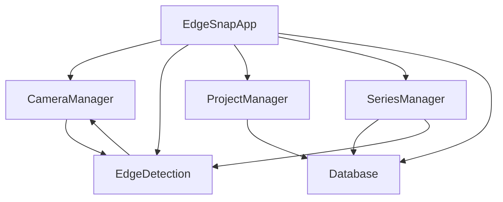

# EdgeSnap Application Architecture

## Overview

EdgeSnap is a Progressive Web App (PWA) designed for document scanning with edge detection capabilities. The app captures photos using device cameras, applies edge detection overlays, and organizes them into projects with filmstrip navigation and movie playback features.

## Core Architecture

The application follows a modular architecture with distinct classes handling specific responsibilities:

- **EdgeSnapApp** (`js/app.js`) - Main application controller and event coordinator
- **CameraManager** (`js/camera.js`) - Camera selection, constraints, and video stream management
- **EdgeDetection** (`js/edgeDetection.js`) - OpenCV-based edge detection and overlay rendering
- **ProjectManager** (`js/projectManager.js`) - Project creation, selection, and deletion
- **SeriesManager** (`js/seriesManager.js`) - Photo storage, navigation, and filmstrip management
- **Database** (`js/database.js`) - IndexedDB storage abstraction
- **MoviePlayer** (`js/moviePlayer.js`) - Filmstrip animation and movie playback

## 1. Application Initialization Flow

### Startup Sequence (`EdgeSnapApp.init()`)

1. **Database Initialization**
   - Creates IndexedDB database for local storage
   - Sets up object stores for projects and photos
   - Handles version upgrades and migrations

2. **Camera System Setup**
   - Requests camera permissions via `getUserMedia()`
   - Enumerates available video input devices
   - Automatically selects best cameras (front/back detection)
   - Applies 16:10 aspect ratio constraints with high resolution

3. **Edge Detection Initialization**  
   - Waits for OpenCV.js library to load
   - Sets up canvas overlay for edge rendering
   - Configures camera layout change listeners

4. **Component Initialization**
   - SeriesManager: Sets up photo management and filmstrip
   - ProjectManager: Loads existing projects and creates default if needed
   - MoviePlayer: Prepares animation canvas and controls

5. **Event System Setup**
   - Establishes inter-component communication via custom events
   - Sets up UI event listeners for buttons and controls
   - Configures resize and orientation change handlers

```javascript
// Initialization order is critical
await this.database.init();
await this.camera.init();
await this.edgeDetection.init();
this.seriesManager = new SeriesManager(this.database);
this.projectManager = new ProjectManager(this.database);
await this.projectManager.init();
```

## 2. Camera Selection and Management

### Automatic Camera Detection (`CameraManager.selectBestCameras()`)

The app automatically categorizes cameras into front and back types:

**Detection Logic:**
- **Front cameras**: Labels containing "front", "user", "selfie", "facetime"
- **Back cameras**: Everything else (default for single cameras)

**Quality Scoring:**
- Prefers cameras with quality indicators: "4k", "hd", "main", "primary"
- Avoids low-quality indicators: "vga", "low"
- Selects highest-scoring camera per category

### Camera Constraints and Aspect Ratio

**Orientation-Aware Constraints:**
- **Landscape Mode**: `width: 1920px, aspectRatio: 1.6` (16:10)
- **Portrait Mode**: `height: 1920px, aspectRatio: 0.625` (10:16)

```javascript
const constraints = {
  video: {
    deviceId: { exact: deviceId },
    ...(this.isPortraitMode()
      ? { height: { ideal: 1920 }, aspectRatio: { ideal: 0.625 } }
      : { width: { ideal: 1920 }, aspectRatio: { ideal: 1.6 } }
    )
  }
};
```

### Camera Toggle Interface

- **Visibility**: Only shown when both front and back cameras exist
- **UI**: Floating button group with camera icons (📷 back, 🤳 front)
- **Switching**: Maintains aspect ratio constraints when switching cameras

## 3. Preview Rendering and Layout

### Video Stream Management (`CameraManager.startCamera()`)

1. **Stream Acquisition**
   - Applies constraints for device, aspect ratio, and resolution
   - Handles camera permissions and error states
   - Sets video element source to MediaStream

2. **Layout Adaptation**
   - Responds to `loadedmetadata` event for video dimensions
   - Handles device orientation changes and window resizing
   - Applies CSS transforms for front camera mirroring

3. **Dynamic Sizing**
   - Calculates optimal container size within viewport constraints
   - Maintains aspect ratio while fitting available space
   - Updates edge detection canvas to match preview dimensions

### Orientation Handling

The app dynamically adjusts to device orientation:
- **Portrait**: Requests 10:16 aspect ratio (height-focused)
- **Landscape**: Requests 16:10 aspect ratio (width-focused)
- **Mirroring**: Front cameras show mirrored preview (UI convenience)
- **Capture**: Photos are captured in true orientation (not mirrored)

## 4. Photo Capture Process

### Capture Flow (`EdgeSnapApp.capturePhoto()`)

1. **Validation Checks**
   - Ensures camera stream is ready
   - Verifies project is selected
   - Validates app state

2. **Canvas Capture**
   - Creates capture canvas matching video dimensions
   - Draws video frame to canvas (true orientation, no mirroring)
   - Converts to JPEG data URL with 90% quality

3. **Photo Object Creation**
   ```javascript
   const photo = {
     imageData: canvas.toDataURL('image/jpeg', 0.9),
     width: canvas.width,
     height: canvas.height,
     timestamp: new Date(),
     isFrontCamera: this.isFrontFacingCamera()
   };
   ```

4. **Storage and Updates**
   - Saves photo to IndexedDB via SeriesManager
   - Updates filmstrip UI with new thumbnail
   - Triggers edge detection overlay update
   - Dispatches `photoAdded` event for system-wide updates

## 5. Edge Detection System

### OpenCV Integration (`EdgeDetection.init()`)

- **Loading**: Waits for OpenCV.js library (10-second timeout)
- **Readiness**: Checks for `cv.Mat` availability
- **Fallback**: Continues without edge detection if loading fails

### Edge Detection Pipeline (`EdgeDetection.processEdges()`)

1. **Image Preprocessing**
   - Loads reference photo into canvas
   - Converts to OpenCV Mat format
   - Applies Gaussian blur for noise reduction

2. **Edge Detection Algorithm**
   ```javascript
   cv.Canny(blurred, edges, 50, 150); // Canny edge detection
   ```

3. **Post-processing**
   - Dilates edges for better visibility
   - Converts back to ImageData format
   - Caches processed edges for overlay rendering

### Overlay Rendering (`EdgeDetection.updateOverlay()`)

1. **Canvas Synchronization**
   - Matches overlay canvas size to camera preview
   - Handles dynamic resizing and orientation changes

2. **Edge Alignment**
   - Scales edge data to current preview dimensions
   - Accounts for aspect ratio differences
   - Handles camera mirroring for proper alignment

3. **Periodic Updates**
   - Redraws overlay at 10fps during active camera use
   - Only updates when photos exist and edges are enabled
   - Clears overlay when switching to empty projects

## 6. Storage and Project Organization

### Database Schema (`Database.js`)

**Projects Store:**
```javascript
{
  id: number,           // Auto-incrementing primary key
  name: string,         // User-defined project name
  createdAt: Date,      // Creation timestamp
  updatedAt: Date       // Last modification time
}
```

**Photos Store:**
```javascript
{
  id: number,           // Auto-incrementing primary key
  projectId: number,    // Foreign key to projects
  imageData: string,    // Base64 JPEG data URL
  width: number,        // Photo pixel width
  height: number,       // Photo pixel height
  timestamp: Date,      // Capture time
  isFrontCamera: boolean // Camera type flag
}
```

### Project Management (`ProjectManager`)

**Project Lifecycle:**
1. **Creation**: User input → Database storage → UI update
2. **Selection**: Triggers `projectChanged` event → Updates SeriesManager
3. **Deletion**: Cascades to delete all associated photos

**Default Behavior:**
- Creates "Default Project" if none exist
- Automatically selects projects after creation/deletion
- Maintains current project state across sessions

### Photo Series Management (`SeriesManager`)

**Filmstrip Organization:**
- Photos stored chronologically within projects
- Thumbnail generation for filmstrip display
- Navigation with prev/next controls
- Individual photo deletion capability

**State Management:**
- Tracks current photo selection for edge overlay reference
- Manages filmstrip scroll position
- Handles empty state messaging
- Coordinates with edge detection updates

## 7. Event-Driven Communication

### Custom Events System

The app uses a publish-subscribe pattern via DOM events:

- **`photoAdded`**: Triggers edge overlay and filmstrip updates
- **`projectChanged`**: Updates photo loading and edge overlay
- **`photosLoaded`**: Refreshes edge overlay with new photo set
- **`seriesNavigationChanged`**: Updates edge overlay for selected photo
- **`cameraLayoutChanged`**: Triggers edge detection canvas resize
- **`clearEdgeOverlay`**: Forces edge overlay cleanup

### Component Interactions



**Data Flow Example - Photo Capture:**
1. User clicks capture button → `EdgeSnapApp.capturePhoto()`
2. Camera captures frame → `CameraManager.capturePhoto()`
3. Photo saved → `SeriesManager.addPhoto()` → `Database.addPhoto()`
4. Event dispatched → `document.dispatchEvent('photoAdded')`
5. Edge overlay updated → `EdgeSnapApp.updateEdgeOverlay()`
6. Filmstrip refreshed → `SeriesManager` UI update

## 8. Performance Considerations

### Memory Management
- **Video Streams**: Properly disposed when switching cameras
- **Canvas Resources**: Cleared and resized as needed
- **OpenCV Objects**: Explicitly deleted to prevent memory leaks
- **Event Listeners**: Cleaned up during component destruction

### Optimization Strategies
- **Debounced Resizing**: 300ms delay for layout change handling
- **Periodic Updates**: 100ms intervals for edge overlay redrawing
- **Lazy Loading**: Edge detection only when photos exist
- **Image Compression**: 90% JPEG quality for storage balance

### Error Handling
- **Camera Permissions**: Graceful fallback with user messaging
- **OpenCV Loading**: 10-second timeout with fallback mode
- **Storage Quota**: Not yet implemented (future enhancement)
- **Network Connectivity**: Handled by PWA caching strategies

---

This architecture enables EdgeSnap to provide a seamless document scanning experience while maintaining clean separation of concerns and robust error handling throughout the application lifecycle.