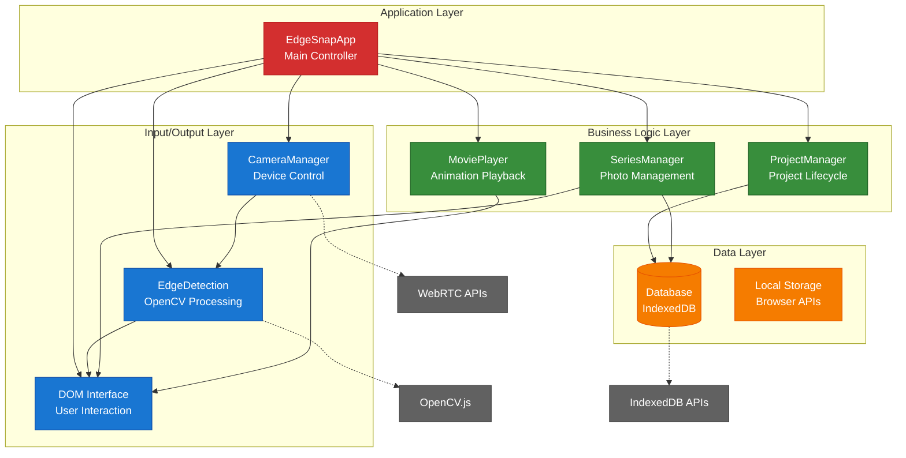
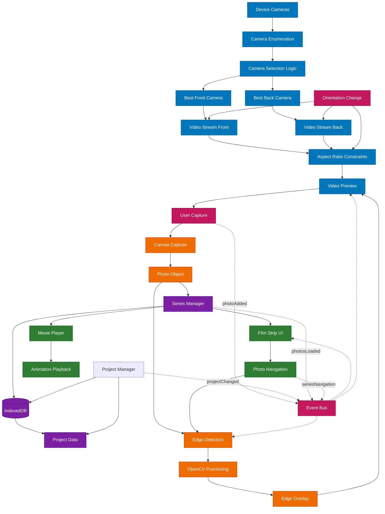
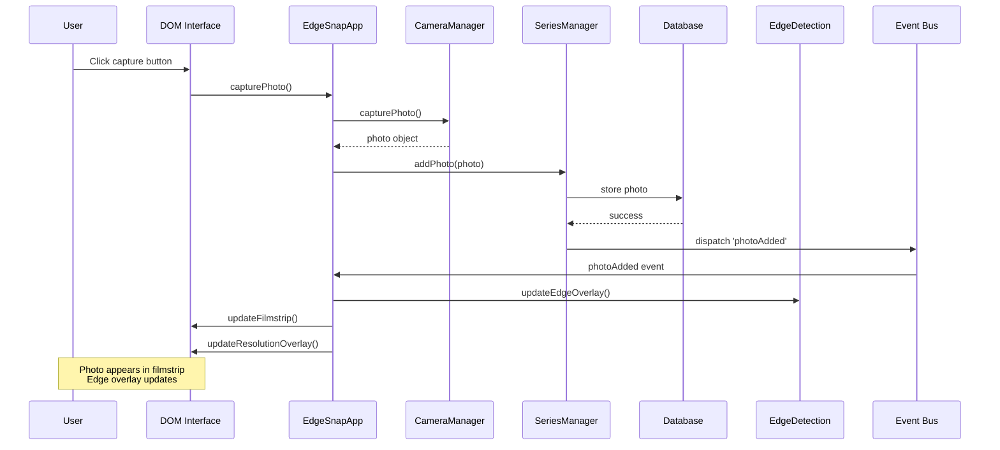

# EdgeSnap Technical Documentation

## Overview

EdgeSnap is a Progressive Web Application (PWA) for document scanning and stop-motion photography with real-time edge detection capabilities. Built with vanilla JavaScript and OpenCV.js, it provides professional-grade camera controls, automatic aspect ratio management, and local storage for privacy-focused photo organization.

## System Architecture

### Core Component Overview

The application follows a modular, event-driven architecture with distinct responsibilities:

- **EdgeSnapApp** (`js/app.js`) - Main application controller and event coordinator
- **CameraManager** (`js/camera.js`) - Automatic camera selection, constraints, and stream management
- **EdgeDetection** (`js/edgeDetection.js`) - OpenCV-based edge detection and overlay rendering
- **ProjectManager** (`js/projectManager.js`) - Project lifecycle and organization
- **SeriesManager** (`js/seriesManager.js`) - Photo storage, navigation, and filmstrip management
- **Database** (`js/database.js`) - IndexedDB storage abstraction
- **MoviePlayer** (`js/moviePlayer.js`) - Filmstrip animation and playback

### Component Architecture



### Data Flow Architecture



## 1. Application Initialization

### Startup Sequence (`EdgeSnapApp.init()`)

```javascript
// Critical initialization order
await this.database.init();          // IndexedDB setup
await this.camera.init();            // Camera system
await this.edgeDetection.init();     // OpenCV loading
this.seriesManager = new SeriesManager(this.database);
this.projectManager = new ProjectManager(this.database);
await this.projectManager.init();   // Project loading
```

**Initialization Flow:**
1. **Database Setup**: Creates IndexedDB with object stores for projects/photos
2. **Camera Permission**: Requests `getUserMedia()` access
3. **Device Enumeration**: Scans and categorizes available cameras
4. **Automatic Selection**: Chooses best front/back cameras
5. **OpenCV Loading**: Waits for WebAssembly module (10s timeout)
6. **Component Linkage**: Establishes event-driven communication
7. **UI Creation**: Generates camera toggles and resolution overlay

## 2. Intelligent Camera System

### Automatic Camera Detection (`CameraManager.selectBestCameras()`)

**Device Categorization Logic:**
```javascript
// Front camera detection
const isFront = label.includes("front") || 
               label.includes("user") || 
               label.includes("selfie") || 
               label.includes("facetime");
```

**Quality Scoring Algorithm:**
- **High Quality**: `4k`, `uhd`, `main`, `primary` (+3-5 points)
- **Standard Quality**: `hd`, `high` (+2 points)
- **Enhanced Features**: `wide` (+1 point)
- **Low Quality**: `vga`, `low` (-2 points)

### Aspect Ratio Management

**Orientation-Adaptive Constraints:**
```javascript
// Landscape: 16:10 aspect ratio
const landscapeConstraints = {
  width: { ideal: 1920 },
  aspectRatio: { ideal: 1.6 }
};

// Portrait: 10:16 aspect ratio  
const portraitConstraints = {
  height: { ideal: 1920 },
  aspectRatio: { ideal: 0.625 }
};
```

**Dynamic Orientation Handling:**
- **Detection**: `window.innerHeight > window.innerWidth`
- **Stream Restart**: Automatic camera restart on orientation change
- **Constraint Update**: New aspect ratio applied immediately
- **Layout Sync**: UI adapts to new video dimensions

### Camera Toggle Interface

**Visibility Logic:**
- **Single Camera**: No toggle shown
- **Multiple Cameras**: Floating button group (📷 back, 🤳 front)
- **Positioning**: Bottom-left with safe area insets
- **State Management**: Active camera highlighted

## 3. Edge Detection System

### OpenCV.js Integration

**Initialization Process:**
```javascript
// Wait for OpenCV with timeout
const checkOpenCV = setInterval(() => {
  if (typeof cv !== "undefined" && cv.Mat) {
    this.isOpenCVReady = true;
    clearInterval(checkOpenCV);
    resolve();
  }
}, 100);
```

**Edge Detection Pipeline:**
1. **Image Loading**: Reference photo converted to OpenCV Mat
2. **Preprocessing**: Gaussian blur for noise reduction
3. **Edge Detection**: Canny algorithm with optimized thresholds
4. **Post-processing**: Morphological operations for clarity
5. **Overlay Rendering**: Scaled and positioned on live preview

### Canvas Overlay System

**Dynamic Sizing:**
- **Canvas Synchronization**: Matches camera preview dimensions
- **Aspect Ratio Handling**: Compensates for preview vs capture differences
- **Orientation Adaptation**: Updates on device rotation
- **Performance Optimization**: Only redraws when necessary

**Rendering Pipeline:**
```javascript
// Edge overlay update cycle
if (this.edgesEnabled && this.edgeImageData && hasPhotos()) {
  this.updateCanvasSize();
  this.drawEdges();
}
```

## 4. Storage Architecture

### IndexedDB Schema

**Projects Store:**
```javascript
{
  id: number,           // Auto-incrementing key
  name: string,         // User-defined name
  createdAt: Date,      // Creation timestamp
  updatedAt: Date       // Last modification
}
```

**Photos Store:**
```javascript
{
  id: number,           // Auto-incrementing key
  projectId: number,    // Foreign key reference
  imageData: string,    // Base64 JPEG data URL
  width: number,        // Capture dimensions
  height: number,
  timestamp: Date,      // Capture time
  isFrontCamera: boolean // Camera type flag
}
```

### Data Management

**Transaction Patterns:**
- **Read Operations**: Simple object store access
- **Write Operations**: Transaction-wrapped for integrity
- **Bulk Operations**: Batched for performance
- **Error Handling**: Retry logic with exponential backoff

**Storage Optimization:**
- **JPEG Compression**: 90% quality for size/quality balance
- **Lazy Loading**: Photos loaded on-demand
- **Cleanup Automation**: Cascading deletes for project removal

## 5. Event-Driven Communication

### Custom Event System

**Core Events:**
- `photoAdded` → Updates edge overlay and filmstrip
- `projectChanged` → Triggers photo loading and UI updates
- `photosLoaded` → Refreshes edge overlay with new dataset
- `seriesNavigationChanged` → Updates overlay for selected photo
- `cameraLayoutChanged` → Triggers canvas resizing
- `clearEdgeOverlay` → Forces overlay cleanup

**Event Flow Example - Photo Capture Workflow:**



## 6. Performance Optimizations

### Memory Management

**Resource Cleanup:**
```javascript
// Camera stream disposal
this.stream.getTracks().forEach(track => track.stop());

// OpenCV object cleanup  
src.delete(); dst.delete(); edges.delete();

// Canvas context optimization
ctx.clearRect(0, 0, canvas.width, canvas.height);
```

**Optimization Strategies:**
- **Debounced Events**: 300ms delay for resize/orientation handling
- **Periodic Updates**: 100ms intervals for edge overlay redrawing
- **Conditional Processing**: Edge detection only when photos exist
- **Stream Efficiency**: Camera restart only on actual orientation change

### Browser Compatibility

**Core API Dependencies:**
- **getUserMedia** (required): Camera access - Chrome/Firefox/Safari/Edge
- **IndexedDB** (required): Data persistence - Universal support
- **Canvas 2D** (required): Edge overlay rendering - Universal support
- **WebAssembly** (required): OpenCV.js execution - Modern browsers
- **Service Worker** (optional): PWA features - Progressive enhancement

## 7. Error Handling & Recovery

### Camera Error Management

**Permission Handling:**
```javascript
try {
  await navigator.mediaDevices.getUserMedia({ video: true });
} catch (error) {
  this.showError("Camera access denied or not available");
}
```

**Fallback Strategies:**
- **Device Enumeration**: Graceful handling of missing cameras
- **Resolution Fallback**: Automatic constraint relaxation
- **Stream Recovery**: Automatic restart on orientation change
- **UI Adaptation**: Toggle visibility based on camera availability

### Storage Error Recovery

**Quota Management:**
- **Detection**: Monitor IndexedDB quota usage
- **User Notification**: Clear warnings before hitting limits
- **Cleanup Tools**: Project deletion for space recovery
- **Graceful Degradation**: Continue operation with limited storage

### Edge Detection Fallbacks

**OpenCV Loading:**
- **Timeout Handling**: 10-second loading limit
- **Graceful Degradation**: App continues without edge detection
- **Error Messaging**: Clear user feedback on failures
- **Recovery**: Retry mechanisms for transient failures

## 8. Security & Privacy

### Data Protection

**Local-First Architecture:**
- **No Cloud Sync**: All data remains on device
- **IndexedDB Isolation**: Domain-specific storage
- **HTTPS Requirement**: Secure camera access
- **No Telemetry**: Zero external data transmission

**Camera Security:**
- **Permission-Based**: Explicit user consent required
- **Session-Limited**: No persistent camera access
- **Preview-Only**: Video data not transmitted
- **User Control**: Camera can be disabled/switched anytime

## 9. PWA Implementation

### Service Worker Strategy

**Caching Approach:**
- **App Shell**: Cache-first for UI resources
- **Content**: Network-first for user data
- **Offline Fallback**: Graceful degradation when offline

### Installation & Updates

**Manifest Configuration:**
- **App Identity**: Branding and display settings
- **Orientation**: Responsive to device capabilities
- **Installation**: Add to home screen support
- **Updates**: Automatic service worker updates

## 10. Development Architecture

### Code Organization

**Modular Design:**
- **Single Responsibility**: Each class handles one domain
- **Loose Coupling**: Event-driven communication
- **Dependency Injection**: Database passed to components
- **Configuration-Driven**: Aspect ratios and constraints externalized

**Testing Considerations:**
- **Unit Testing**: Individual component isolation
- **Integration Testing**: Event flow validation
- **Camera Mocking**: Testing without physical cameras
- **Storage Mocking**: IndexedDB simulation for tests

### Extensibility Points

**Future Enhancement Areas:**
- **Export Formats**: Additional photo/video export options
- **Cloud Integration**: Optional backup/sync capabilities
- **Advanced Edge Detection**: Algorithm swapping architecture
- **Filter System**: Real-time video processing pipeline
- **Collaboration**: Multi-device project sharing

---

This architecture enables EdgeSnap to deliver professional-grade photo capture and organization while maintaining simplicity, privacy, and cross-platform compatibility.